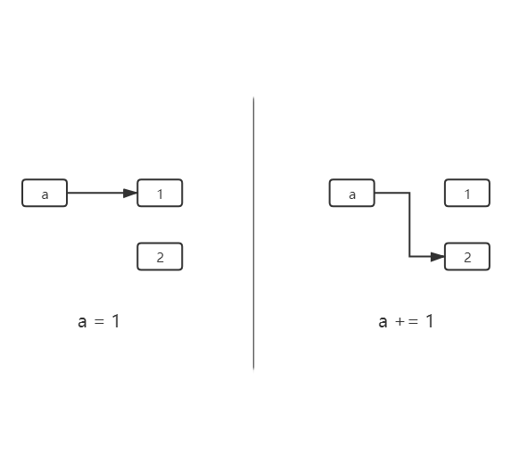
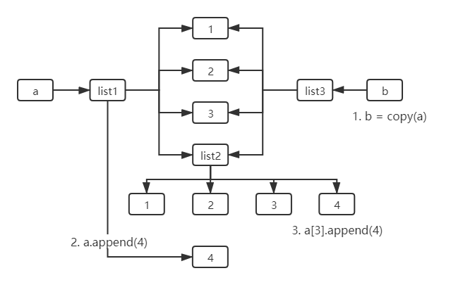

先从Python的变量讲起，Python的变量比较特殊，变量本身不占空间，而是变量指向的内存地址占空间。变量名可以理解为该内存空间的别名，与C语言的引用类似。也可以更通俗地理解为：内存空间是一个瓶子，而变量名是瓶子的标签。

```python
print(id(5))
a = 5
print(id(a))
```

结果如下：

```bash
140704116623136
140704116623136
```

---

## 可变对象与不可变对象

有句话是这么说的：“Python万物皆对象”，不管是数字1还是字符串"Hello world"，又或者是更复杂的列表，他们都是对象。而对象按照其是否可变又分为可变对象与不可变对象。

### 可变对象

可变对象就是对象可以在内存地址不变的情况下改变数值。换句话说，可以在不创建新对象的情况下改变对象的值。

```python
a = [1, 2, 3]
print("a =", a)
print("id =", id(a))
a.append(4)
print("a =", a)
print("id =", id(a))
```

结果如下：

```bash
a = [1, 2, 3]
id = 2595801473344
a = [1, 2, 3, 4]
id = 2595801473344
```


可以看到，在列表a添加了子元素4之后，其值发生改变，但是其内存地址并没有发生改变，或者说，没有创建新对象。

> Python中常见的可变对象有：
>
> - 列表list
> - 集合set
> - 字典dict

### 不可变对象

与可变对象相对应，不可变对象就是必须创建新对象才能改变其值。

```python
a = 1
print("a=", a)
print("id =", id(a))
a += 1
print("a=", a)
print("id =", id(a))
```

结果如下：

```bash
a = 1
id = 140704172066464
a = 2
id = 140704172066496
```



可以看到当a的数值从1增加到2后，a的id值也发生了变化，而本质上其实是a创建了新对象，该过程等价于：

```python
a = int(1)
print("a=", a)
print("id =", id(a))
a = int(2)
print("a=", a)
print("id =", id(a))
```

> Python中常见的不可变对象有：
>
> - 整型int
> - 字符串str
> - 元组tuple

---

## 赋值、浅拷贝与深拷贝的区别

### 可变对象的赋值、浅拷贝与深拷贝

#### 赋值

赋值只是简单的引用。之前我们说过，Python变量的变量名可以理解为该内存地址的别名，而将一个变量赋值给另一个变量，其本质也相同。我们以一个例子说明：

```python
a = [1, 2, 3]
b = a
print("a =", a)
print("b =", b)
print("a.id =", id(a))
print("b.id =", id(b))
a.append(4)
print("-"*20)
print("a =", a)
print("b =", b)
print("a.id =", id(a))
print("b.id =", id(b))
```

结果如下：

```bash
a = [1, 2, 3]
b = [1, 2, 3]
a.id = 1565564084608
b.id = 1565564084608
--------------------
a = [1, 2, 3, 4]
b = [1, 2, 3, 4]
a.id = 1565564084608
b.id = 1565564084608
```

可以看到，通过赋值的方式，a和b有一样的id值，指向的列表是一样的，所以一直保持`b = a`


#### 浅拷贝

我们直接看例子：

```python
from copy import copy
a = [1, 2, 3, [1, 2, 3]]
b = copy(a)
print("a =", a)
print("b =", b)
print("a.id =", id(a))
print("b.id =", id(b))
print("a[3].id =", id(a[3]))
print("b[3].id =", id(b[3]))
print("-"*25)
a.append(4)
a[3].append(4)
print("a =", a)
print("b =", b)
print("a.id =", id(a))
print("b.id =", id(b))
print("a[3].id =", id(a[3]))
print("b[3].id =", id(b[3]))
```

结果如下：

```bash
a = [1, 2, 3, [1, 2, 3]]
b = [1, 2, 3, [1, 2, 3]]
a.id = 2753416727552
b.id = 2753417852608
a[3].id = 2753416742336
b[3].id = 2753416742336
-------------------------
a = [1, 2, 3, [1, 2, 3, 4], 4]
b = [1, 2, 3, [1, 2, 3, 4]]
a.id = 2753416727552
b.id = 2753417852608
a[3].id = 2753416742336
b[3].id = 2753416742336
```

从结果看，经过浅拷贝后，列表`a`和列表`b`的id值（内存地址）不同，表示`a`和`b`是两个不同的列表对象，因此当`a`添加新元素时，`b`的值不会发生变化。但是，`a[3] = [1, 2, 3]`是列表，前面说过列表是可变对象，而`a[3]`和`b[3]`的id值是一样的，因此当`a[3]`对象发生变化时（对象内的增删改，不创建新对象），`b[3]`也对应发生改变。



#### 深拷贝

直接看例子：
`注意：这个例子和上面浅拷贝的一样，只是把copy换成deepcopy`

```python
from copy import deepcopy
a = [1, 2, 3, [1, 2, 3]]
b = deepcopy(a)
print("a =", a)
print("b =", b)
print("a.id =", id(a))
print("b.id =", id(b))
print("a[3].id =", id(a[3]))
print("b[3].id =", id(b[3]))
print("-"*25)
a.append(4)
a[3].append(4)
print("a =", a)
print("b =", b)
print("a.id =", id(a))
print("b.id =", id(b))
print("a[3].id =", id(a[3]))
print("b[3].id =", id(b[3]))
```

结果如下：

```bash
a = [1, 2, 3, [1, 2, 3]]
b = [1, 2, 3, [1, 2, 3]]
a.id = 2259013929984
b.id = 2259015054976
a[3].id = 2259013944704
b[3].id = 2259015054272
-------------------------
a = [1, 2, 3, [1, 2, 3, 4], 4]
b = [1, 2, 3, [1, 2, 3]]
a.id = 2259013929984
b.id = 2259015054976
a[3].id = 2259013944704
b[3].id = 2259015054272
```

从结果来看，`b`完全不受`a`的影响。是的，这就是深拷贝，它相当于逐层的浅拷贝，不管是`a`和`b`还是`a[3]`和`b[3]`，它们的id值（内存地址）都不相同，它们都是不同的对象，因此当一方发生变化时，另外一方不受影响。


### 不可变对象的赋值、浅拷贝与深拷贝

不可变对象是不可变的，发生变化时必然创建新对象，因此不管是赋值、浅拷贝还是深拷贝，当一方变化时，另外一方都不会受到影响。

```python
from copy import copy, deepcopy
a = 1
b = a
c = copy(a)
d = deepcopy(a)
print("a =", a, "b =", b, "c =", c, "d =", d)
print("a.id =", id(a), "b.id =", id(b), "c.id =", id(c), "d.id =", id(d))
print("-"*25)
a += 1
print("a =", a, "b =", b, "c =", c, "d =", d)
print("a.id =", id(a), "b.id =", id(b), "c.id =", id(c), "d.id =", id(d))
```

```bash
a = 1 b = 1 c = 1 d = 1
a.id = 140704172066464 b.id = 140704172066464 c.id = 140704172066464 d.id = 140704172066464
-------------------------
a = 2 b = 1 c = 1 d = 1
a.id = 140704172066496 b.id = 140704172066464 c.id = 140704172066464 d.id = 140704172066464
```

---

## 结论

- 对于可变对象（列表、字典、集合等）
    - 赋值（b = a）：使b和a保持绝对的同步，当一方发生变化时（对象内的增删改，不创建新对象），另外一方也会发生同样的变化
    - 浅拷贝（c = copy(a)）：会拷贝一层，即id(a) != id(c)。但是，当a的子元素也是可变对象时，该可变对象发生变化时（对象内的增删改，不创建新对象），c中对应的可变对象也会跟着一起变化
    - 深拷贝（d = deepcopy(a)）：d和a是完全独立的两个对象，a发生任何变化都不会影响d
- 对于不可变对象（整型、字符串、元组等）
    - 不管是赋值、浅拷贝还是深拷贝，当一方发生变化时，另外一方都完全不受影响

---