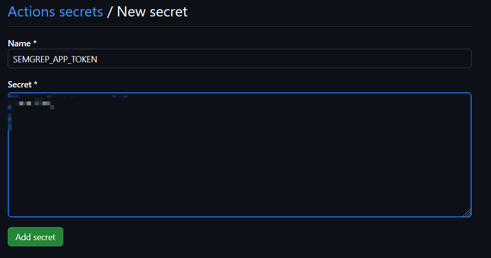
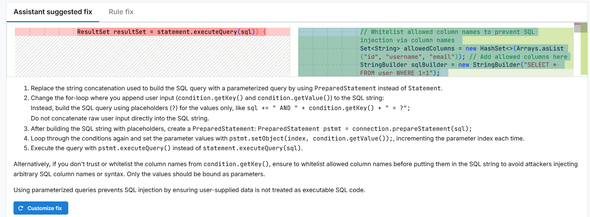

### 0. 前言

本文属于基础讲解，如果不熟悉Github Actions和Semgrep也没有关系，按照步骤来就可以

Github Actions：https://docs.github.com/zh/actions

Semgrep：https://semgrep.dev

Semgrep AppSec Platform：https://semgrep.dev/signup

### 1. 准备Github项目

在Github上随意一个项目即可：https://github.com/new

### 2. 创建Semgrep Token

在Github Actions中集成Semgrep时，需要使用到Semgrep Token。

1、首先，登录[Semgrep AppSec Platform](https://semgrep.dev/signup )

2、来到`Settings`->`Tokens`->`API tokens`，点击`Create new token`


3、Token scopes选择`Agent(CI)`即可；Name自定义即可；记得把`Secrets value`复制出来，需要注意该值只能在创建时才能看到，后续就无法看到和使用了，只能创建新的Token


### 3. 在Github项目Secret中设置Semgrep token

在GitHub项目中点击`Settings`->`Secrets and variables`->`Actions`->`New repository secret`创建代码仓库的Secret


Semgrep token命名为`SEMGREP_APP_TOKEN`（可以自定义），将第2步中创建的Semgrep Token值填入Secret中，并保存



### 4. 创建Github Actions工作流

在项目根目录下创建`.github/workflows/semgrep.yml`文件

下面这个工作流是从Semgrep官网上拿下来的，做了少量修改。这里简单解释一下，若还不清楚，可以参考[Github Actions](https://docs.github.com/zh/actions )做进一步学习

```yaml
name: Semgrep
on:
  # 发生pull request时触发扫描
  pull_request: {}
  # 允许在GitHub Actions页面下手动点击触发
  workflow_dispatch: {}
  # 在以下分支push代码时触发
  push:
    branches:
      - main
      - master
      - dev

permissions:
  # 用于查看扫描结果和推送扫描报告到Github Security
  security-events: write
  contents: read
  actions: read

jobs:
  semgrep:
    # GitHub Actions job
    name: semgrep/ci
    runs-on: ubuntu-latest

    container:
      # 使用semgrep官方的容器，自带相关环境
      image: semgrep/semgrep

    # 跳过机器人创建的PR等操作，避免越权或无意义扫描
    if: (github.actor != 'dependabot[bot]')

    steps:
      # Github Actions标准的checkout，用于检出代码，无需关心
      - uses: actions/checkout@v4
      # 关键地方
      # semgrep ci：使用CI的方式启动semgrep扫描，会使用到默认的社区版+pro版的规则集
      # --pro：会启动pro模式，该模式下才能实现污点分析的跨文件扫描。例如controller层的用户输入在service层进行了SQL拼接导致SQL注入，开启pro模式才能扫描出来
      # --sarif：输出sarif格式的扫描报告
      - run: semgrep ci --pro --sarif > semgrep.sarif
        env:
          # 此处就是在第3步中设置的Secret，如果自定义了名称，将"SEMGREP_APP_TOKEN"修改为自定义的名称即可
          SEMGREP_APP_TOKEN: ${{ secrets.SEMGREP_APP_TOKEN }}

      # 上传sarif扫描报告到Github Security中
      - name: Upload SARIF file for GitHub Advanced Security Dashboard
        uses: github/codeql-action/upload-sarif@v3
        with:
          sarif_file: semgrep.sarif
        if: always()
```

### 5. 启动扫描

可以添加一些存在漏洞的测试代码，然后push到项目中，工作流会自动开启扫描。下面给出基于Springboot的测试代码，你也可以自己编写测试代码：

```java
package com.example.demo.controller;

import com.example.demo.entity.User;
import com.example.demo.vo.Response;
import com.example.demo.vo.sqli.SQLiRequest;
import jakarta.annotation.Resource;
import org.springframework.beans.factory.annotation.Value;
import org.springframework.web.bind.annotation.PostMapping;
import org.springframework.web.bind.annotation.RequestBody;
import org.springframework.web.bind.annotation.RequestMapping;
import org.springframework.web.bind.annotation.RestController;

import java.sql.*;
import java.util.ArrayList;
import java.util.Arrays;
import java.util.List;
import java.util.Map;

@RestController
@RequestMapping("/sqli")
public class SQLiController {
    @Value("${spring.datasource.url}")
    private String dbUrl;

    @Value("${spring.datasource.username}")
    private String dbUsername;

    @Value("${spring.datasource.password}")
    private String dbPassword;

    @PostMapping("/jdbc-bad-1")
    public Response<List<User>> jdbcBad1(@RequestBody SQLiRequest request) {
        Map<String, Object> conditions = request.getConditions();
        List<User> result = new ArrayList<>();
        // 获取JDBC连接并执行SQL查询
        try (Connection connection = DriverManager.getConnection(dbUrl, dbUsername, dbPassword)) {
            // 执行SQL查询
            String sql = "SELECT * FROM user WHERE 1=1";
            if (conditions != null && !conditions.isEmpty()) {
                for (Map.Entry<String, Object> condition : conditions.entrySet()) {
                    sql += " AND " + condition.getKey() + " = \"" + condition.getValue() + "\"";
                }
            }
            try (Statement statement = connection.createStatement();
                 ResultSet resultSet = statement.executeQuery(sql)) {
                // 处理查询结果
                while (resultSet.next()) {
                    // 从结果集中获取数据
                    int id = resultSet.getInt("id");
                    String username = resultSet.getString("username");
                    result.add(new User(id, username, null));
                }
            }
            return Response.success(result);
        } catch (SQLException e) {
            e.printStackTrace();
            return Response.fail(e.getMessage());
        }
    }

    @PostMapping("/jdbc-bad-2")
    public Response<List<User>> jdbcBad2(@RequestBody SQLiRequest request) {
        Map<String, Object> conditions = request.getConditions();
        List<Object> args = new ArrayList<>();
        List<User> result = new ArrayList<>();
        // 获取JDBC连接并执行SQL查询
        try (Connection connection = DriverManager.getConnection(dbUrl, dbUsername, dbPassword)) {
            // 执行SQL查询
            String sql = "SELECT * FROM user WHERE 1=1";
            if (conditions != null && !conditions.isEmpty()) {
                for (Map.Entry<String, Object> condition : conditions.entrySet()) {
                    sql += " AND " + condition.getKey() + " = ?";
                    args.add(condition.getValue());
                }
            }
            try (PreparedStatement statement = connection.prepareStatement(sql)) {
                for (int i = 0; i < args.size(); i++) {
                    statement.setObject(i + 1, args.get(i));
                }
                try (ResultSet resultSet = statement.executeQuery()) {
                    // 处理查询结果
                    while (resultSet.next()) {
                        // 从结果集中获取数据
                        int id = resultSet.getInt("id");
                        String username = resultSet.getString("username");
                        result.add(new User(id, username, null));
                    }
                }
            }
            return Response.success(result);
        } catch (SQLException e) {
            e.printStackTrace();
            return Response.fail(e.getMessage());
        }
    }
}
```

### 6. 在Github Security中查看扫描结果


### 7. 在Semgrep AppSec Platform中查看扫描结果

Semgrep AppSec Platform提供了更丰富的查询，并且每次扫描时会将最新结果同步到Github Security中，更加方便


如果开启了AI辅助模式，还能给出修复建议：



